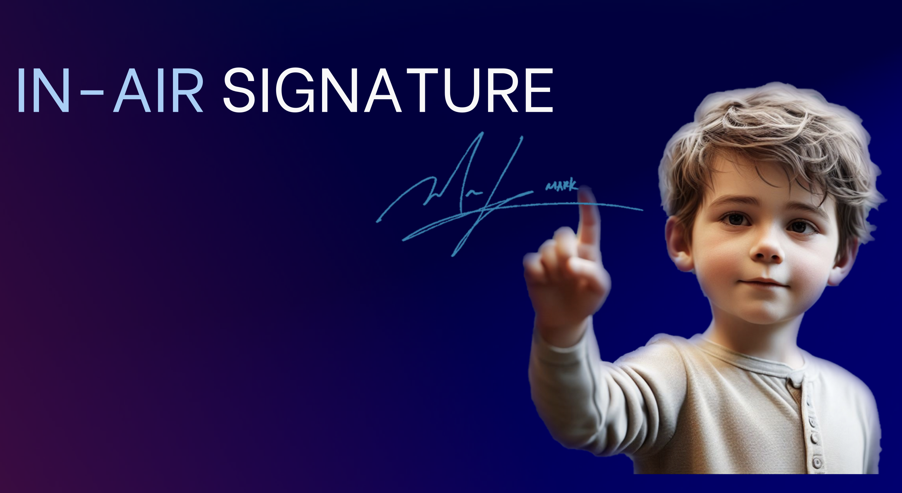
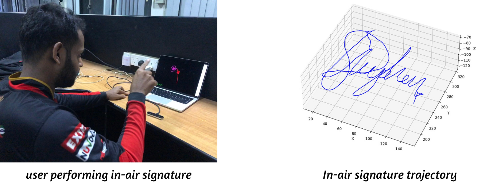

# In - Air Signature



A new manner of performing signature where the user signs in air using free hand movements.

## Description

- We need to accurately acquire user's signature while providing good user experience.

- During In-Air Signature, a user's whole signature trajectory is recorded which includes pen-up as well as pen-down movements. 

- Therefore we need to detect and remove pen-up strokes from the signature trajectory.


## How it Works

- Run the vizualier.py file in the examples folder.
- The application will start to collect data by tracking the index finger.
- A realtime vizualisation will be provided in the desktop.

## Screenshots

### Sample Signature


### Project Setup



## Demo Video

<!--  -->


# Project Setup and other details
<!--links-->
[apache]: http://www.apache.org/licenses/LICENSE-2.0 "Apache V2 License"

[developer-site-tracking-software]: https://developer.leapmotion.com/tracking-software-download "Ultraleap Tracking Software"
[developer-site-setup-camera]: https://developer.leapmotion.com/setup-camera "Ultraleap Setup Camera"
[developer-forum]: https://forums.leapmotion.com/ "Developer Forum"
[discord]: https://discord.com/invite/3VCndThqxS "Discord Server"
[github-discussions]: https://github.com/ultraleap/leapc-python-bindings/discussions "Github Discussions"

<!--content-->
# Gemini LeapC Python Bindings

[](mailto:support@ultraleap.com)
[][discord]


Open-source Python bindings for the Gemini LeapC API. Allowing developers to use Ultraleaps Hand Tracking technology
with Python. Including build instructions and some simple examples to get started with. 

## Getting Started:

To use this plugin you will need the following:

1. The latest Gemini Ultraleap Hand Tracking Software. You can get this [here][developer-site-tracking-software].
2. An Ultraleap Hand Tracking Camera - follow setup process [here][developer-site-setup-camera].
3. Follow one of the Installation workflows listed below.

## Installation:

This module makes use of a compiled module called `leapc_cffi`. We include some pre-compiled python objects with our
Gemini installation from 5.17 onwards. Supported versions can be found [here](#pre-compiled-module-support). If you 
have the matching python version and have installed Gemini into the default location you can follow the steps below:

```
# Create and activate a virtual environment
pip install -r requirements.txt
pip install -e leapc-python-api
python examples/tracking_event_example.py
```

### Custom Install

This module assumes that you have the Leap SDK installed in the default location. If this is not the case
for you, you can use an environment variable to define the installation location. Define the environment variable
`LEAPSDK_INSTALL_LOCATION` to the path of the `LeapSDK` folder, if you have installed to a custom location or moved it 
somewhere else.

Example:
`export LEAPSDK_INSTALL_LOCATION="C:\Program Files\CustomDir\Ultraleap\LeapSDK"`

By default, this path is the following for each operating system:
- Windows: `C:/Program Files/Ultraleap/LeapSDK`
- Linux x64: `/usr/lib/ultraleap-hand-tracking-service`
- Linux ARM: `/opt/ultraleap/LeapSDK`
- Darwin: `/Applications/Ultraleap Hand Tracking.app/Contents/LeapSDK`

## Pre-Compiled Module Support

The included pre-compiled modules within our 5.17 release currently only support the following versions of python:

- Windows: Python 3.8
- Linux x64: Python 3.8
- Darwin: Python 3.8
- Linux ARM: Python 3.8, 3.9, 3.10, 3.11

Expanded pre-compiled support will be added soon. However, this does not restrict you to these versions, if you wish to 
use a different python version please follow the instructions below to compile your own module.

### Missing Compiled Module?

You might not have the correct matching compiled `leapc_cffi` module for your system, this can cause issues when importing
leap, such as: `ModuleNotFoundError: No module named 'leapc_cffi._leapc_cffi'`
If you'd like to build your own compiled module, you will still require a Gemini install and a C compiler of your 
choice. Follow the steps below:

```
# Create and activate a virtual environment
pip install -r requirements.txt
python -m build leapc-cffi
pip install leapc-cffi/dist/leapc_cffi-0.0.1.tar.gz
pip install -e leapc-python-api
python examples/tracking_event_example.py
```


## License

Use of the LeapC Python Bindings is subject to the [Apache V2 License Agreement][apache].

